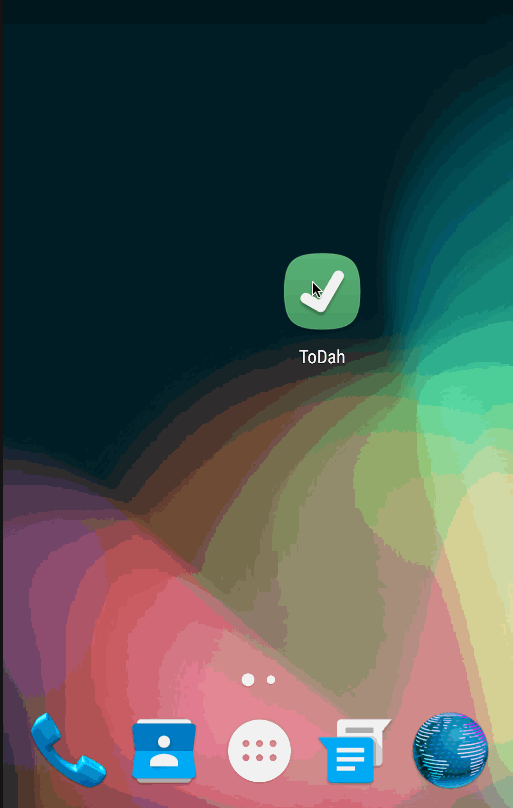

# ToDah

This is an Android demo app which provides basic todo list management.

Time Spent: 3-4 hours in total

Completed user stories:

* [x] Required: Can you successfully add and remove items from the todo list within your app?
* [x] Required: Did you include support for editing todo items as described above?
* [x] Required: Does your app persist todo items and retrieve them properly on app restart?
* [x] Required: Did you successfully push your code to github? Can you see the code on github?
* [x] Required: Did you add a README which includes a GIF walkthrough of the app's functionality?
* [x] Required: Did you create an issue on the repo and include /cc @codepathreview @codepath in the issue body?
* [x] Optional: Persist the todo items into SQLite instead of a text file
* [x] Optional: Improve style of the todo items in the list using a custom adapter
* [x] Optional: Add support for completion due dates for todo items (and display within listview item)
    - I didn't like the design of showing them in the listview item, but implemented due dates so counting this as completed
* [ ] Optional: Use a DialogFragment instead of new Activity for editing items
    -  I didn't like this UI, so didn't implement this.  However I did use a dialog for confirming delete.

 Notes:  I read up on material design a little bit, mostly to play around with in this app (but it doesn't implement it really).

## Features

1. create new todo
1. edit todo
1. delete todo
1. complete todo
1. filter todos
1. persists todos in SQLite db
1. persists filtering settings in SQLite db

GIF created with [LiceCap](http://www.cockos.com/licecap/).

Icon downloaded from [IconArchive](http://www.iconarchive.com/show/captiva-icons-by-bokehlicia/checkbox-icon.html).

## Future Enhancements

These are things I'd like to do with this in the future one I learn more about Android dev.

1. implement tests against activitys/adapters/ui
1. validate user input (e.g. require title)
1. animations for transitions (esp. around the floating action button)
1. implement a checkbox on the listview to complete actions
1. implement swipe on the listview to delete the item
1. implement drag and drop on the listview to change order
1. implement support for filtering late todos
